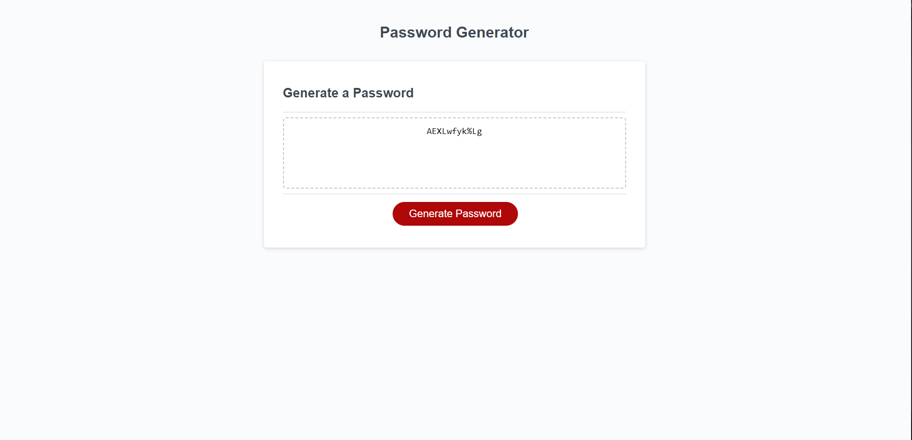

# password-generator-refactoring

## Description

### This project was designed to provide a random password through a random password generator that includes lowercase and uppercase letters, special characters, and numbers. This specific application includes prompts and alerts through the use of JavaScript.

## Built With

### JavaScript, HTML, and CSS

## Screenshot

## Website Link

[https://alexhannani.github.io/password-generator-refactoring/](https://alexhannani.github.io/password-generator-refactoring/)